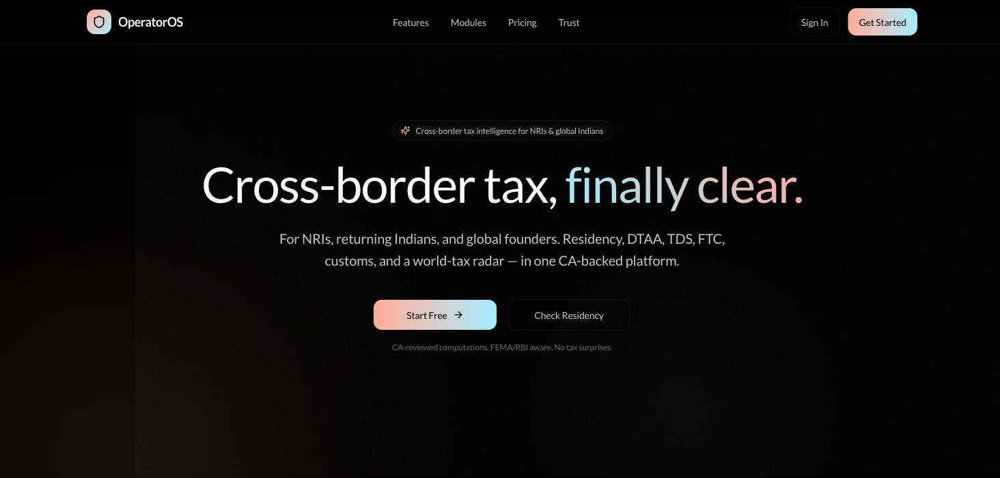
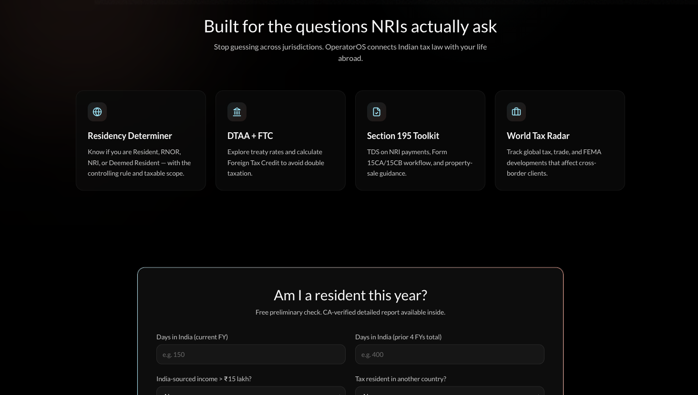
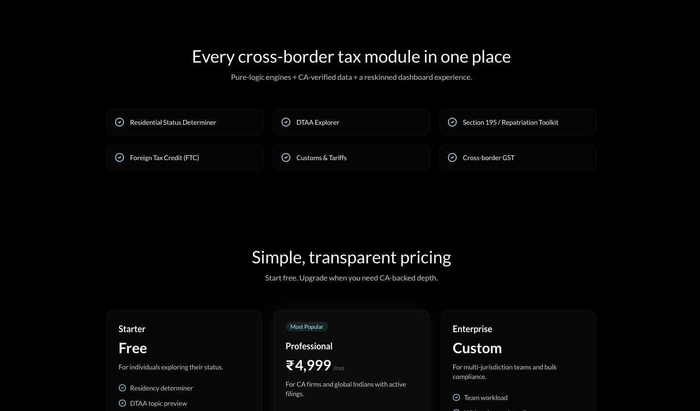
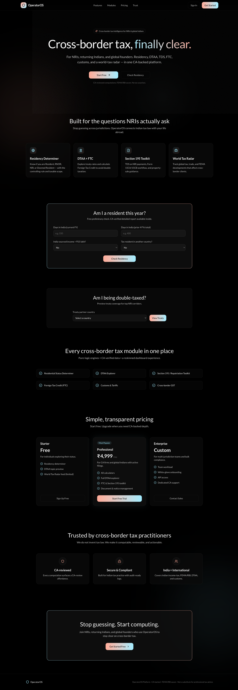
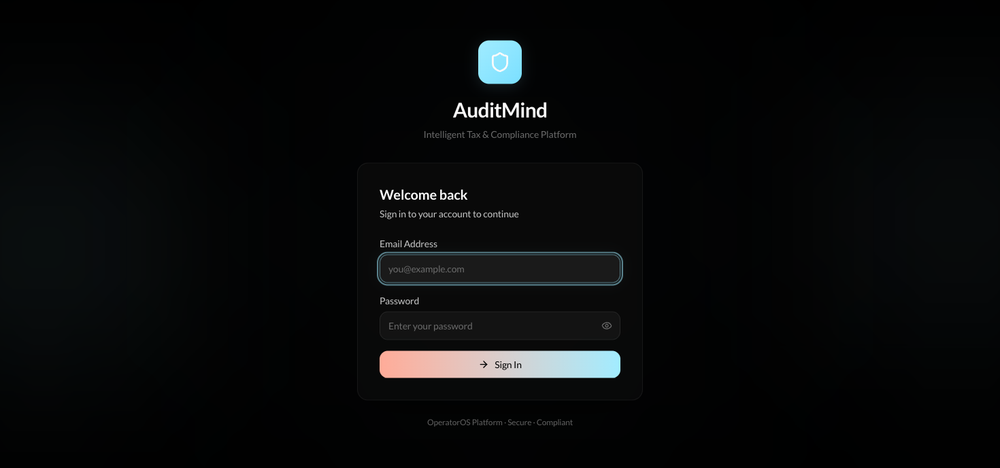

<div align="center">

<br />

# OperatorOS

### Cross-border tax, _finally clear._

**A premium tax-intelligence platform for NRIs, returning Indians, and global founders** — Residency, DTAA, §195, FTC, Customs & a live World Tax Radar, in one CA-backed workspace.

<br />


<br />


<br />



<br />

</div>

---

## The problem

If you've ever lived, earned, or invested across borders, you've asked these out loud — and gotten three different answers:

> **Am I a resident this year?** · **Am I being double-taxed?** · **How much TDS on my property sale?** · **What changed in the law while I was away?**

OperatorOS answers all four — with computation engines that refuse to guess, and a live radar that watches the world's tax desks so you don't have to.

<div align="center">

</div>

---

## The modules

Six purpose-built cross-border engines, on top of a full Indian tax & compliance suite.

| Module | What it does |
|---|---|
| **Residency Determiner** | Resident / RNOR / NRI / **Deemed Resident** — the controlling rule and your exact taxable scope, AY-keyed (incl. the 1 Apr 2026 change). |
| **DTAA Explorer** | Treaty rates (dividends/interest/royalty/FTS/cap-gains) + tie-breaker + TRC / Form 10F requirements for the top NRI corridors. |
| **Section 195 Toolkit** | TDS on payments to NRIs, the **Form 15CA/15CB** workflow, lower-deduction routes, and property-sale TDS. |
| **Foreign Tax Credit** | Rule 128 / **Form 67** calculator — per-country allowable FTC, DTAA vs non-DTAA. |
| **Customs & Tariffs** | HSN-keyed landed cost — **BCD + SWS + cess + IGST**, with FTA preferential-rate flags. |
| **World Tax Radar** | A live feed of global tax & trade developments — DTAA changes, **BEPS / Pillar Two**, tariffs, FEMA — scored by NRI impact. |

Plus the domestic core: **Income Tax** (old/new regime), **TDS**, **GST**, **Capital Gains** with CII indexation, interest 234A/B/C, HRA, depreciation, a RAG **AI advisor**, document intelligence, notice drafting, and a compliance calendar.

---

## Built to be trusted, not just clever

> OperatorOS **never invents tax law.** Every pure computation is unit-tested; every rate, treaty value, and customs duty is sourced from authoritative texts and **CA-reviewed** before it goes live. Until a value is verified, the engine returns *"pending CA review"* — not a confident wrong number.

That single design choice is what separates a demo from something you'd stake a client's filing on.

---

## Architecture

```
┌─ Frontend ────────────────┐     ┌─ Backend ─────────────────────────────┐
│  React 18 · Vite · TS      │ ──▶ │  FastAPI · SQLAlchemy (async)          │
│  Tailwind v4 · TanStack    │ HTTP│  Pydantic · JWT + RBAC                  │
│  Textura design system     │     │  Tax engine (Decimal, fully tested)    │
└────────────────────────────┘     │  RAG: pgvector + free-llm-router       │
                                    │  Celery workers · Redis · Alembic      │
┌─ World Tax Radar ─────────┐  push └────────────────────────────────────────┘
│  social_scraper + LLM      │ ────▶  /api/tax-intel  ▸  live radar panel
└────────────────────────────┘
```

**~160 passing backend tests · strict-TypeScript frontend that builds clean · IDOR-hardened, token-typed auth.**

---

## Quickstart

```bash
git clone https://github.com/beepboop2025/operatoros.git
cd operatoros
cp .env.example .env            # set SECRET_KEY (python -c "import secrets;print(secrets.token_hex(32))")

docker compose up               # Postgres+pgvector · Redis · FastAPI · frontend
docker compose exec fastapi alembic upgrade head
docker compose exec fastapi python scripts/seed_data.py   # creates an admin user
```

- App → `http://localhost:5173`  ·  API docs → `http://localhost:8000/docs`

**Frontend only** (to explore the UI without the stack):

```bash
cd frontend && npm install && npm run dev      # → http://localhost:5173
```

---

## Pricing model (in-app)

<div align="center">

</div>

---

## Gallery

<div align="center">

| The landing | Sign in |
|:--:|:--:|
|  |  |

</div>

---

## Status

| Layer | State |
|---|---|
| Tax & cross-border engines, tests, CI | ✅ Complete |
| Textura redesign — landing + full dashboard | ✅ Complete |
| NRI screens + World Tax Radar | ✅ Complete |
| Security hardening (IDOR, token typing) | ✅ Complete |
| CA-verified DTAA / customs data | 📋 In progress — see [`CA_DATA_CHECKLIST.md`](CA_DATA_CHECKLIST.md) |

---

## License

OperatorOS is **source-available** — not open source. You're welcome to read it, study
how it's built, fork it on GitHub, and run it locally. But **commercial use, hosting it as
a service, or building a competing product requires a separate commercial license.** See
[`LICENSE.md`](LICENSE.md).

> The engines are public. The **CA-verified data that makes them trustworthy is not** — and
> that's the part worth licensing. Curious what the full, data-complete product can do?
> Open an issue. ★ the repo to follow where this goes.

---

<div align="center">
<sub>Built with the <strong>Textura</strong> design language · pure-black stage, icy <code>#A1ECFF</code> + peach <code>#FFAB98</code> accents, Gilda Display × Lato.</sub>
<br /><br />
<strong>OperatorOS</strong> — <em>stop guessing, start computing.</em>
</div>
